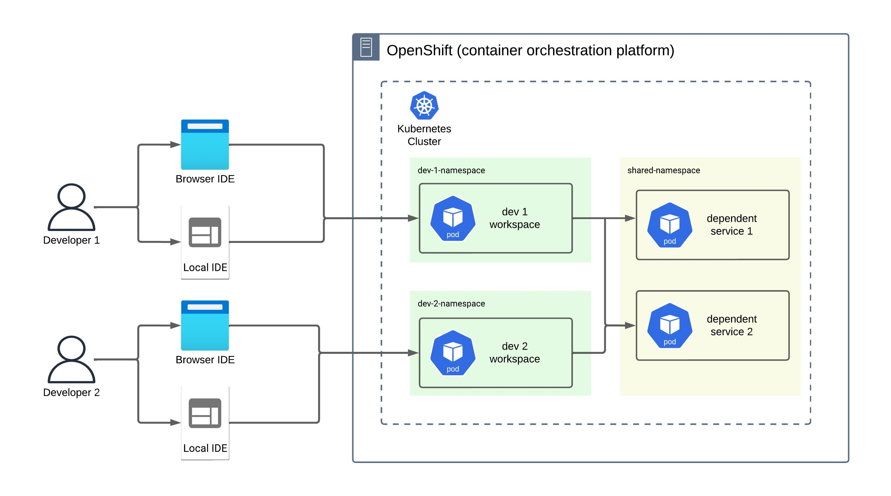
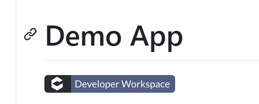
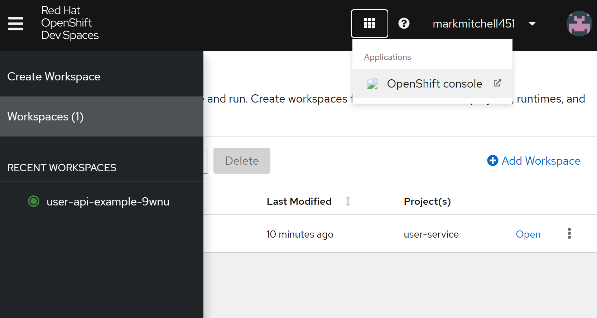
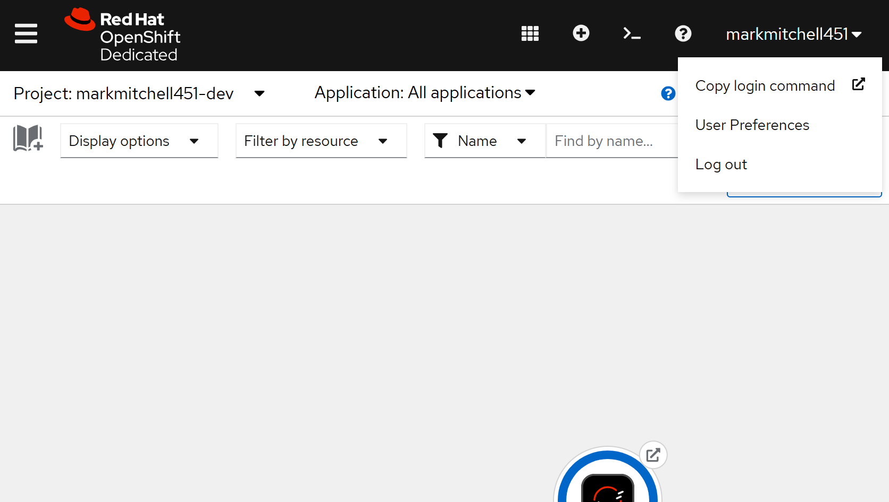
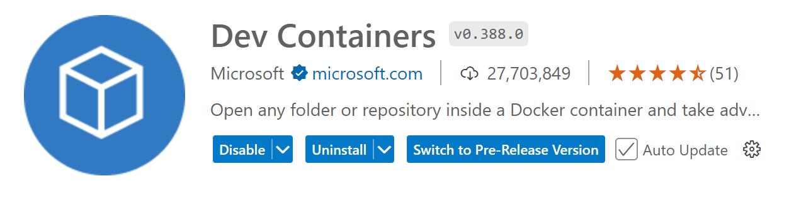

# Remote Development Environment

A remote kubernetes development environment backed by [Eclipse Che](https://eclipse.dev/che/).

<a href="https://mm-camelcase.github.io/site/k8s_devenv_mini.mp4">
    
</a>

**Click image for a [demo](https://mm-camelcase.github.io/site/k8s_devenv_mini.mp4)**


## Overview

A cloud-based development environment that provides a remote setup for developing, testing, and debugging Kubernetes-based applications. This example is deployed to OpenShift, but it could equally be deployed on your public or private Kubernetes clusters using Eclipse Che. 

### Why remote?  

Remote development environments offer several key benefits  
- **Simplified Onboarding**:  Click on a link and start coding
- **Consistency**: Eliminate the "_it works on my machine_" problem.
- **Accessibility**: Develop from anywhere without needing a powerful local setup. All you need is a browser and an internet connection.
- **Scalability**: The remote Kubernetes cluster can scale resources as needed, providing more power for compiling and testing without taxing local machines.


### Prefer a local IDE?
Eclipse Che provides a browser-based IDE out of the box. If you prefer your local IDE, no problem! You can easily connect it to your remote workspace and work just like with a local filesystem (see [Local IDE](https://github.com/mm-camelcase/k8s-remote-devenv?tab=readme-ov-file#local-ide) below).

### Architecture



- Each developer gets their own environment, segregated via Kubernetes namespaces, ensuring isolated workspaces without interference.

- There is a shared namespace for any resources or service dependencies required by the target project.

- Each developer can use either the browser IDE or their local IDE to interact with their workspace, depending on their preference.

- Workspaces run within individual Kubernetes pods, which provide an isolated environment for development activities.

- Dependent services are managed within shared namespaces to allow consistent access and avoid redundancy.

- This architecture leverages the capabilities of OpenShift to orchestrate and manage the Kubernetes cluster, ensuring scalability and reliability.


## Prerequisites

This environment depends on the following tools & services:

- A Developer Sandbox a/c for Red Hat OpenShift, see  [free trial](https://developers.redhat.com/developer-sandbox?source=sso).

- [Docker](https://docs.docker.com/desktop/setup/install/linux/)
- [OpenShift CLI (oc)](https://docs.redhat.com/en/documentation/openshift_container_platform/4.17/html/cli_tools/openshift-cli-oc#cli-about-cli_cli-developer-commands) - a command-line interface for Red Hat OpenShift

## Project setup

Each project that you want to work on in the remote development environment must contain a devfile.

The devfile allows you to define your workspace:

- The image to run.
- The endpoints to expose for development.
- The commands to build, test, debug, and run your target project.

See example [devfile](https://github.com/mm-camelcase/user-service/blob/che/devfile.yaml).

A one-click setup link can be added to each project that you want to develop in the dev environment, simplifying the initialization process for developers.



## Workspace setup

The worksopce is controled by the image referenced in the devfile
All the nesessory tooling required should be installed to the workspace image.

This example uses a stripped down version of `quay.io/devfile/universal-developer-image:ubi8-latest`, see `ubi9/dockerfile`.  

```bash
docker build -t che-devenv-image .
docker tag che-devenv-image camelcasemm/che-devenv-image:2.0.0
docker push camelcasemm/che-devenv-image:2.0.0
```

Fore details on how to extend the base developer workspace images see https://github.com/devfile/developer-images?tab=readme-ov-file#extending-the-base-image


## Local IDE


To connect to the remote workspace using your local IDE (e.g., VS Code), follow these steps:

1. **Login to OC CLI**

The `oc` CLI is the command-line interface for Red Hat OpenShift, which allows developers and administrators to interact with an OpenShift cluster from their local terminal. It is similar to the `kubectl` CLI for Kubernetes but has additional features and commands that are specific to OpenShift.

|  |  |
|--------------------------------------|------------------------------------------|
| **Dev Spaces Console**                          | **Openshift Console**                            |


- From the **_Dev Spaces Console_**, click **_Applications icon_**, then **_Openshift console_**
- From the **_Openshift console_**, click **Copy login command** 

```bash
oc login --token=*********** --server=https://api.sandbox-m4.*****.p1.openshiftapps.com:6443
```


2. **Set Up Port Forwarding:**   
Use the following commands to forward the port from your development pod (`user-api-example` in this case):

```bash
DEV_WORKSPACE_NAME="user-api-example"
DEV_POD_NAME=$(oc get pods -o json | jq -r --arg prefix "$DEV_WORKSPACE_NAME" '.items[] | select(.metadata.labels["controller.devfile.io/devworkspace_name"] | startswith($prefix)) | .metadata.name')
oc port-forward "$DEV_POD_NAME" 3000:3000
```

3. **Install Dev Containers Extension:**    
In VS Code, install the "Dev Containers" extension. This extension allows you to open and work with containers as development environments.



4. **Connect to the Remote Workspace:**
    - Open VS Code
    - click **_View_**, then **_Command Pallette..._**
    - Select **_Dev Containers: Attach to Running Kubernetes Container_**
    - Choose the pod you want to connect to (in this case, the port-forwarded pod).
    - Choose the container you want to connect to (in this case, the `devenv` container as defined in the example [devfile](https://github.com/mm-camelcase/user-service/blob/che/devfile.yaml#L7)).


